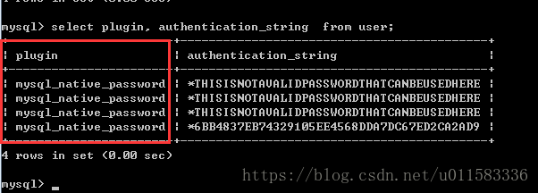

这是一个用来测试docker的django项目
后端用的mysql数据库，同样部署在docker里

## 运行前的准备

- Dockerfile
- requirements.txt
- run.sh
- pip.conf
- settings.py里的ALLOW_HOSTS节点加入了对应的ip
- DATABASES节点配置了对应的数据库。
用户名、密码、端口、HOST、数据库名是docker容器里mysql数据库的用户名、密码、端口
(这里的端口不是myslq容器对外暴露的端口，而是mysql容器原来的端口，即3306)、HOST(对应的mysql容器名)、数据库名。
(数据库在部署mysql容器时创建)

## 运行

### 1. 建立内部网络
docker network create demo-net

### 2. 确保mysql容器正常并且连入网络
##### 构建mysql镜像
docker pull mysql:8.0.16
#### 运行mysql容器
docker run -p 3307:3306 --name mysqldb -v /Users/mac/Documents/projects/docker/mysql/conf:/etc/mysql/conf.d -v /Users/mac/Documents/projects/docker/mysql/logs:/logs -v /Users/mac/Documents/projects/docker/mysql/data:/var/lib/mysql -e MYSQL_ROOT_PASSWORD=456wyg -d mysql:8.0.16
#### 修改加密规则
use mysql;
select plugin,authentication_string from user;

如果跟图中的值不同，请进行下面的操作

```shell script
ALTER USER 'root'@'localhost' IDENTIFIED BY 'password' PASSWORD EXPIRE NEVER; #修改加密规则 

ALTER USER 'root'@'localhost' IDENTIFIED WITH mysql_native_password BY 'password'; #更新一下用户的密码 

FLUSH PRIVILEGES; # 刷新权限

# 再重置下密码：
alter user 'root'@'localhost' identified by '123456';

# 最后重启服务。
```

参考：[mysql报错RuntimeError: cryptography is required for sha256_password or caching_sha2_p](https://blog.csdn.net/p_xiaobai/article/details/85334875)

#### mysql容器接入内部网络 demo-net
docker network connect demo-net mysql_container_id
#### 查看网络，确保mysql容器已经接入
docker network inspect demo-net
#### 进入mysql容器，创建test数据库
`docker exec -it ec7d4a7a06da(容器id) /bin/bash`

### 3. 确保项目容器正常，并且已经连入容器
#### 构建项目镜像
docker build  --name dockerdemo2 .
#### 运行项目容器
docker run -d --name dockerdemo2 -p 9000:8080 --network=demo-net dockerdemo2
退出容器，在宿主机上执行
docker exec dockerdemo2_container_id /bin/bash run.sh
#### 查看网络，确保项目容器接入了网络
docker network inspect demo-net

### 4. 访问 ip:9000 查看项目

### 5. 参考文档
[docker笔记（3) ------Django项目的docker部署](https://www.cnblogs.com/ziwen1942/p/10259601.html)